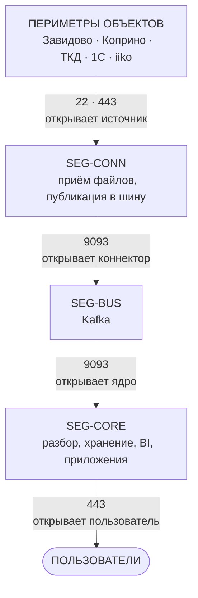
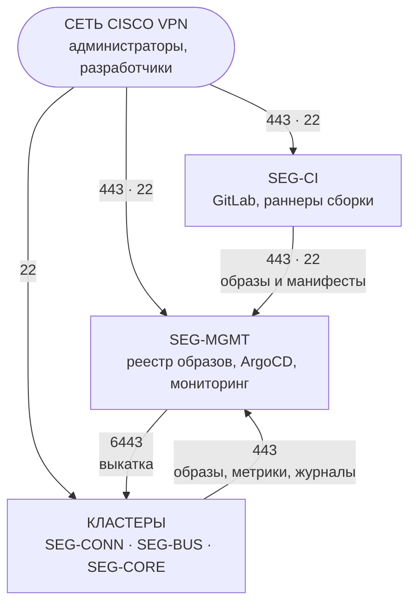

# Принятые решения по платформе

---

## 0. Что требуется развернуть

Коротко: шесть новых подсетей, по одному адресу под точку входа в двух из них и правила из
таблиц 1.1 и 1.2. Ещё две подсети уже существуют.

### 0.1 Подсети

| Сегмент | Машин | Что в нём | Размер |
|---|---|---|---|
| `SEG-CONN` | 3 | Приём файлов от источников | /27 |
| `SEG-BUS` | 3 | Kafka | /27 |
| `SEG-CORE` | 8 | Разбор, базы, BI, приложения | /27 |
| `SEG-MGMT` | 3 | Реестр образов, выкатка, мониторинг | /27 |
| `SEG-CI` | 2 | GitLab и раннеры | Уже есть: `10.200.0.0/24` |
| `SEG-CONN-DEV` | 1 | То же, что `SEG-CONN`, но одним узлом | /28 |
| `SEG-BUS-DEV` | 1 | То же, что `SEG-BUS` | /28 |
| `SEG-CORE-DEV` | 3 | То же, что `SEG-CORE` | Уже есть: `10.11.11.0/24` |

Размеры с запасом: подсеть должна пережить добавление узлов без переезда.

**Два сегмента из восьми уже существуют.** `SEG-CI` — это машины GitLab, `SEG-CORE-DEV` — нынешний
кластер из трёх машин `vasta-app`, `vasta-app-2` и `vasta-db`. Заказывать нужно шесть подсетей и
двадцать с небольшим машин, остальное работает.

Непродуктивный контур повторяет продуктивный по строению — те же три сегмента и те же правила
между ними. Отличаются только размеры машин и число узлов. Это нужно, чтобы проверять на dev не
только сервисы, но и сетевую часть — правила, политики, поведение при недоступности шины.
Подробнее в разделе 7.

### 0.2 Что ещё нужно

* **По одному свободному адресу** в `SEG-CONN` и в `SEG-CORE` — под точки входа, отдельно от
  адресов узлов. Плюс разрешение анонсировать их по ARP внутри сегмента. Одного адреса на сегмент
  хватает: службы на нём различаются портом, а веб-интерфейсы — именем.
* **Запись DNS** `*.bi.<домен>` на адрес входа в `SEG-CORE`.
* **Подтвердить, что диапазоны `10.42.0.0/16` и `10.43.0.0/16` свободны.** Это внутренняя
  адресация кластеров, наружу она не выходит, но при конфликте с корпоративной узлы не смогут
  обращаться к внешним системам. Если заняты — назовите свободные.
* **Правила межсетевого экрана** — таблицы 1.1 и 1.2.
* **Доступ из сети Cisco VPN** в `SEG-MGMT` и `SEG-CI`.
* **MTU 1500 между узлами** внутри каждого сегмента, без дополнительной инкапсуляции.
* **Не блокировать ICMP тип 3 код 4** и не сбрасывать простаивающие сессии на 6443 раньше часа.

Пояснения к последним двум пунктам — в разделе 2.7.

---

## 1. Сегменты и кластеры

| Сегмент | Кластер | Что внутри |
|---|---|---|
| `SEG-CONN` | `k8s-connectors` | Приём файлов от источников и публикация в шину |
| `SEG-BUS` | `k8s-bus` | Kafka, 3 брокера |
| `SEG-CORE` | `k8s-apps` | Разбор, ClickHouse, PostgreSQL, MinIO, BI, приложения |
| `SEG-MGMT` | `k8s-mgmt` | Реестр образов, ArgoCD, мониторинг и журналы |
| `SEG-CI` | — | GitLab, раннеры сборки (раздел 6) |

Непродуктивный контур устроен так же: `SEG-CONN-DEV`, `SEG-BUS-DEV`, `SEG-CORE-DEV` с теми же
правилами между ними. `SEG-CORE-DEV` уже существует — это нынешний кластер из трёх машин.
Раздел 7.

### 1.1 Потоки данных

Ради чего всё построено: путь данных от источника до пользователя.

Стрелки показывают движение данных, подпись — кто открывает соединение. Они часто противоположны:
ядро читает данные из шины, но соединение открывает само.

| Граница | Соединение открывает | Порт | Что передаётся |
|---|---|---|---|
| Периметр объекта → `SEG-CONN` | Источник | 22/TCP | Выгрузка файлов Opera по SFTP |
| Периметр объекта → `SEG-CONN` | ВМ в периметре iiko | 443/TCP | Отправка собранных данных |
| `SEG-CONN` → `SEG-BUS` | Коннектор | 9093/TCP | Публикация в топики |
| `SEG-CORE` → `SEG-BUS` | Сервис-потребитель | 9093/TCP | Чтение топиков |
| Рабочие места → `SEG-CORE` | Пользователь | 443/TCP | Веб-интерфейсы, вход через Keycloak |

Пять строк на весь конвейер. В варианте с отдельными виртуальными машинами их было двадцать два.

### 1.2 Служебные потоки

Выкатка, мониторинг и администрирование. Данные по ним не ходят.

Кластеры собраны в один блок: правила для них одинаковы. Между `SEG-MGMT` и кластерами движение в
обе стороны — выкатка идёт туда, образы и телеметрия обратно. Те же правила действуют для
кластеров непродуктивного контура (раздел 7).

| Граница | Соединение открывает | Порт | Что передаётся |
|---|---|---|---|
| `SEG-CI` → `SEG-MGMT` | Раннер сборки | 443/TCP, 22/TCP | Выкладка образов и манифестов |
| Узлы всех кластеров → `SEG-MGMT` | Узел кластера | 443/TCP | Скачивание образов |
| Все кластеры → `SEG-MGMT` | Агент сбора Alloy | 443/TCP | Отправка метрик и журналов |
| `SEG-MGMT` → `SEG-CONN`, `SEG-BUS`, `SEG-CORE` | ArgoCD | 6443/TCP | Разворачивание конфигурации |
| `SEG-MGMT` → `SEG-CI` | Агент сбора Alloy | 9100/TCP | Метрики машин GitLab и раннеров |
| `SEG-MGMT` → интернет | Реестр | 443/TCP | Пополнение зеркала внешних реестров |
| Сеть Cisco VPN → `SEG-MGMT` | Администратор | 443/TCP, 22/TCP | Интерфейсы ArgoCD и Grafana, административный доступ |
| Сеть Cisco VPN → `SEG-CI` | Разработчик, администратор | 443/TCP, 22/TCP | GitLab: веб-интерфейс и работа с репозиториями |
| Сеть Cisco VPN → узлы всех кластеров | Администратор | 22/TCP | Административный доступ |

Метрики и журналы принимаются через ingress кластера управления, поэтому отдельных портов под них
не нужно — всё на 443. Внутри кластеров телеметрия ходит по внутренней сети и границ не
пересекает.

**`SEG-MGMT` и `SEG-CI` доступны только из сети Cisco VPN.** Из интернета к ним обращений нет,
отдельного бастиона не требуется. Ни выкатка, ни GitLab снаружи не публикуются.

Встречные правила не нужны ни в одной из таблиц: ответный трафик разрешается по состоянию сессии.

### 1.3 Каких соединений нет

Всё, что не перечислено в двух таблицах выше, закрыто. Отдельно называем то, что должно
оставаться закрытым всегда:

* **Обращений ядра к источникам.** Ядро получает данные только из шины и об источниках не знает.
* **Доступа к шине снаружи.** Kafka не принимает соединений из интернета и из периметров.
* **Прямого доступа к базам.** ClickHouse, PostgreSQL и MinIO доступны только изнутри `SEG-CORE`.
* **Обращений из кластеров в GitLab.** Кластеры видят только `SEG-MGMT`, исходный код им
  недоступен. Обратно тоже: GitLab и раннеры в кластеры не ходят.
* **Выхода в интернет у кластеров.** Наружу ходит только `SEG-MGMT`, за образами.

### 1.4 Пояснения

**Коннекторы вынесены из периметров объектов.** Это возможно там, где источник отправляет данные
сам — Opera по SFTP, 1С своим выгрузчиком. 

Что это даёт:

* **шина не выставляется наружу.** Коннектор в периметре был бы обязан дотянуться до Kafka на
  9093, то есть шину пришлось бы открыть каждому объекту. Сейчас снаружи принимается только
  выгрузка файлов — узкая функция, которую защитить проще, чем кластер Kafka;
* **наш код не живёт в чужой инфраструктуре.** Исправление логики разбора — выкат, а не выезд на
  площадку;
* **работает мониторинг.** Опрос метрик в периметре был бы входящим соединением, которого ваша
  схема не допускает;
* **один сегмент вместо машины в каждом объекте.**

**Почему один кластер на все коннекторы.** Собрать их вместе можно именно потому, что они
вынесены из периметров. Узлы одного кластера видят друг друга, поэтому кластер, растянутый по
четырём периметрам, связал бы периметры между собой — изоляция объектов исчезла бы.

**Почему шина отдельным кластером.** Граница кластера должна совпадать с границей сегмента. Все
узлы кластера находятся в общей внутренней сети, и если положить Kafka в общий кластер с ядром,
источник при подключении к шине получил бы канал внутрь ядра. Коннекторы в кластер шины по той же
причине не кладём: шина должна оставаться простым компонентом, а коннекторы принимают
непроверенные данные извне.

**Что выигрывает настройка экрана.** В варианте с отдельными виртуальными машинами получалось
22 правила. Здесь на периметре остаётся пять строк из таблицы 1.1, а разграничение внутри
сегментов уходит в политики кластера — они хранятся в системе контроля версий и проходят такое же
согласование, как код.

---

## 2. Узлы

### 2.1 `k8s-connectors`

Три узла, совмещающие управление и нагрузку: встроенное хранилище состояния k3s требует трёх.

| Узлов | На узел |
|---|---|
| 3 | 4 / 8 / 150 ГБ |

Вместо размещения отдельный вм на каждом стороннем оборудовании предагаю просто у нас сделать слой коннекторов. Не вижу смысла в каждом отдельном месте (завидово, коприно, ткд, 1с) делать по одной машине и туда как-то отдельно подлезать, выкладывать код, мониторить, дебажить и прочее. Вместо этого у нас делаем отдельной подсетью мини кластер с 3 узлами, где все размещаем. Коннекторы, sftp серверы и прочие специфические для источника данных обработчики, которые все это обрабатывают и складывают в шину.

Единственное уязвимое место — файл, принятый, но ещё не опубликованный в шину. Поэтому порядок
обязателен: подтверждение отправителю выдаётся только после подтверждения от шины, локальная
копия удаляется после него же. Возможно поднятие второго маленького s3 для локального хранения файлов и дебага в случае, если ошибка программная произошла

### 2.2 `k8s-bus`

Три узла, тоже совмещённые.

| Узлов | На узел | Тома |
|---|---|---|
| 3 | 2 / 8 | 300 ГБ под журналы брокера |

Внутри: оператор Strimzi и Kafka — 3 брокера, KRaft, RF=3, `min.insync.replicas=2`.

### 2.3 `k8s-mgmt`

Три узла, совмещённые.

| Узлов | На узел | Тома |
|---|---|---|
| 3 | 6 / 16 | 500 ГБ под образы, 500 ГБ под метрики и журналы |

Внутри: реестр образов и зеркало внешних реестров, голые репозитории git, ArgoCD, хранилище
метрик, Loki, Grafana, Alertmanager. Подробнее в разделе 5.

### 2.4 Пулы в `k8s-apps`

| Пул | Метка | Узлов | На узел | Что размещается |
|---|---|---|---|---|
| `services` | `workload=services` | 3 | 6 / 20 / 150 ГБ | Управление кластером, сервис-потребитель, BI, приложения, Keycloak, Keeper |
| `oltp` | `workload=oltp` | 3 | 6 / 24 / 300 ГБ, быстрый диск | PostgreSQL: `pg-core`, `pg-apps` |
| `clickhouse` | `workload=clickhouse` | 1 → 2 | 18 / 72 / 4 ТБ | ClickHouse |
| `s3` | `workload=s3` | 1 | 4 / 8 / 2 ТБ, ёмкостный | MinIO |

**Отдельных управляющих узлов нет.** В k3s управляющий узел сам запускает нагрузку, поэтому эту
роль берут на себя три узла `services` — там нет томов данных, и хранилище состояния кластера
ничему не мешает. Экономия три машины.

Пулы разделены `taint`: посторонние поды на дорогие узлы не попадают. Экземпляры каждой СУБД
разносятся по узлам своего пула правилом антиаффинити.

### 2.5 Что заказывать

| Узлы | vCPU / ОЗУ | Диск данных | Системный диск | Сеть |
|---|---|---|---|---|
| `services` | 6 / 20 | — | 150 ГБ SSD | 10 Гбит/с |
| `oltp` | 6 / 24 | 300 ГБ, p99 записи < 5 мс, ≥ 3000 IOPS (4К случайных) | 100 ГБ | 10 Гбит/с |
| `clickhouse` | 18 / 72 | 4 ТБ, линейное чтение ≥ 300 МБ/с, p99 записи < 5 мс | 100 ГБ | 10 Гбит/с |
| `s3` | 4 / 8 | 2 ТБ ёмкостный | 100 ГБ | 10 Гбит/с |
| `k8s-bus` | 2 / 8 | 300 ГБ, p99 `fsync` < 10 мс | 100 ГБ SSD | 10 Гбит/с |
| `k8s-connectors` | 4 / 8 | — | 150 ГБ SSD | 1 Гбит/с |
| `k8s-mgmt` | 6 / 16 | 500 ГБ образы + 500 ГБ телеметрия, ёмкостный | 100 ГБ SSD | 10 Гбит/с |

Пропорция ОЗУ к процессору 1:4 — обе СУБД опираются на страничный кеш.

* **Системный диск везде SSD, если узел управляющий.** Хранилище состояния кластера пишет
  синхронно, на медленном диске тормозит весь кластер. Управляющие узлы есть в каждом кластере:
  в `k8s-apps` это узлы `services`, в остальных — все узлы.
* **`oltp`** — ОЗУ важнее ядер, узкое место в задержке подтверждения записи. Тонкое выделение с
  переподпиской недопустимо.
* **`clickhouse`** — ядра расходуются полностью, один запрос распараллеливается по всем. На
  массиве не включать дедупликацию, сжатие, перенос между уровнями и снимки: данные уже сжаты в
  6–8 раз, исторические партиции читаются при каждом запросе за период.
* **`services`** — томов данных нет, системный диск больше обычного под образы и журналы. Здесь
  же три Keeper, каждому свой том 20–50 ГБ на SSD, отдельно от тома ClickHouse. Пул урезан с
  8/24 после того, как мониторинг и выкатка уехали в `SEG-MGMT`, а приём файлов — в `SEG-CONN`.
  Из наблюдения здесь остался только агент сбора Alloy.
* **`s3`** — важна пропускная способность: первая полная копия ClickHouse до 2 ТБ, по гигабиту
  это пять часов. Здесь же архив исходных файлов за 12 месяцев, поэтому 2 ТБ — величина, которую
  надо пересчитать по фактическому размеру отчётов Opera, а не принимать как есть.
* **`k8s-bus`** — важна задержка подтверждения записи. Журналы брокеров отдельным томом от
  системного, иначе они конкурируют с состоянием кластера. Через шину идут файлы (раздел 7.1),
  поэтому объём тома зависит от выбранного срока хранения топика.
* **`k8s-connectors`** — требования как у `services`. Томов данных нет: файлы проходят насквозь
  и локально не накапливаются.
* **`k8s-mgmt`** — к задержке нетребователен, важен объём. Два тома: под образы и под телеметрию,
  оба ёмкостные. Обоим нужны политики очистки, иначе они растут бесконечно.
* **Общее** — узлы одного пула одинаковы, системный том отдельно от тома данных. Тома данных
  только блочные, не файловая шара: у PostgreSQL и ClickHouse на ней иная семантика блокировок и
  сброса на диск.

### 2.6 Что уже развёрнуто

Пять машин работает. Ниже — куда они встают в целевой схеме.

| Машина | Адрес | Сейчас | Дальше |
|---|---|---|---|
| `vasta-app` | 195.222.182.125 | Узел кластера. Единственная машина с публичным адресом, через неё же приходит SFTP от Opera | Узел `SEG-CORE-DEV` |
| `vasta-app-2` | 10.11.11.113 | Узел кластера | Узел `SEG-CORE-DEV` |
| `vasta-db` | 10.11.11.112 | ClickHouse и PostgreSQL на одной машине | Узел `SEG-CORE-DEV` |
| `vasta-gitlab` | 10.200.0.92 | GitLab CE | `SEG-CI`, без изменений |
| `vasta-gitlab-runner` | 10.200.0.91 | Раннеры сборки | `SEG-CI`, без изменений |

**Нынешний кластер становится непродуктивным контуром.** Три машины в `10.11.11.0/24` — это и есть
`SEG-CORE-DEV`. Продуктивный контур строится рядом, с нуля. Переносить нечего: ни одна из этих
машин в прод не переезжает.

Из-за этого `SEG-CORE-DEV` — три машины, а не одна, как остальные сегменты непродуктивного
контура. Так вышло исторически, и это скорее плюс: там останется запас на проверку изменений.

**GitLab уже стоит и уже в отдельной сети** `10.200.0.0/24`. Из машин раздела 6 не хватает только
кластера управления.

**Обе базы сейчас на одной машине.** В продуктивном контуре они разъезжаются по разным пулам: у
ClickHouse и PostgreSQL противоположные требования к диску, и на общем томе фоновые слияния
ClickHouse удлиняют каждую фиксацию транзакции в PostgreSQL. На dev это допустимо и остаётся как
есть.

**Административный доступ** ко всем узлам кластера идёт через `vasta-app`, остальные машины
публичного адреса не имеют. sshd вынесен на порт 2222: порт 22 занят публикацией приёма файлов.
В продуктивном контуре приём файлов получает свой адрес, и sshd возвращается на 22.

**Что меняется по входящим из интернета.** Сейчас публичный адрес один и он же узел кластера, то
есть внешнее подключение из интернета приземляется там же, где работают сервисы и базы. Это же
означает, что приём данных Opera сегодня идёт в контур, который станет непродуктивным, — при
запуске прода его надо будет перевести. В целевой схеме входящее
принимает `SEG-CONN`, а ядро внешних соединений не видит — кроме 443 к веб-интерфейсам.

### 2.7 Порты между узлами внутри кластера

Это правила внутри сегмента, между его собственными узлами. Если экран трафик внутри сегмента не
фильтрует, они не нужны. Список одинаков для всех кластеров.

| Порт | Между кем | Зачем |
|---|---|---|
| 6443/TCP | Все узлы → управляющие | Управляющий интерфейс кластера |
| 8472/UDP | Все узлы ↔ все узлы | Внутренняя сеть кластера |
| 10250/TCP | Управляющие → все узлы | Сбор метрик, диагностика, просмотр журналов |
| 2379–2380/TCP | Управляющие ↔ управляющие | Хранилище состояния кластера |

Последняя строка нужна там, где управляющих узлов три: это все продуктивные кластеры. В
однонодовых кластерах непродуктивного контура её нет.

Дополнительно:

* **Диапазоны `10.42.0.0/16` и `10.43.0.0/16`** должны маршрутизироваться между узлами сегмента.
  Наружу они не выходят, но не должны пересекаться с корпоративной адресацией — иначе узел не
  сможет обратиться к внешней системе из этих адресов.
* **MTU.** Внутренняя сеть кластера добавляет 50 байт на пакет. Нужен чистый MTU 1500 между
  узлами без дополнительной инкапсуляции либо увеличенный кадр.
* **ICMP тип 3 код 4 не блокировать.** Иначе определение размера пакета перестаёт работать, и это
  выглядит как случайные зависания при больших ответах.
* **Время жизни простаивающей сессии на 6443 — не меньше часа.** Управляющие соединения долгие и
  большую часть времени молчат; агрессивный сброс выглядит как случайные отказы компонентов.
* **Диапазон NodePort 30000–32767 открывать не нужно.** Службы публикуются на выделенных адресах
  из пула сегмента.

---

## 3. PostgreSQL

Три машины пула `oltp`, закрыты `taint` и заняты только базами. На них работают **две независимые
СУБД**: `pg-core` и `pg-apps`. Каждая — в трёх экземплярах, по одному на машину.

| Машина | Что на ней работает |
|---|---|
| `oltp-1` | Экземпляр `pg-core` + экземпляр `pg-apps` |
| `oltp-2` | Экземпляр `pg-core` + экземпляр `pg-apps` |
| `oltp-3` | Экземпляр `pg-core` + экземпляр `pg-apps` |

`pg-core` и `pg-apps` — это **не машины, а логические СУБД**. У каждой свой набор баз, свои
резервные копии и своя точка восстановления. Обе переживают потерю любой машины: оставшиеся два
экземпляра выбирают новый основной, приложение продолжает работать по тому же адресу.

| СУБД | Базы внутри |
|---|---|
| `pg-core` | `keycloak`, `grafana`, реестр контроля полноты |
| `pg-apps` | `employee`, `inventory` и последующие прикладные |

Внутри `pg-apps` — своя база и своя роль на сервис, `REVOKE CONNECT ... FROM PUBLIC`, ограничение
числа соединений на роль. Поверх копий на уровне СУБД — логические выгрузки по каждой базе, они
дают откат отдельного сервиса.

**Цена отказоустойчивости.** В разделе 4.1 документа по мощностям PostgreSQL — одна машина 4/16.
Три машины нужны потому, что каждая должна уметь принять роль основной. Это плата за
автоматическое переключение вместо ручного.

---

## 4. ClickHouse

Пул `clickhouse` из одного узла на старте, второй узел добавляется при модернизации.

| | Старт | После модернизации |
|---|---|---|
| Узлов в пуле | 1 | 2 |
| Реплик | 1 | 2 |
| Диск | Сетевой блочный, 4 ТБ | Локальный NVMe |
| Защита данных | Копии в MinIO, повторный разбор исходных файлов | Плюс репликация |

**Таблицы объявляются как `Replicated*` сразу**, при одной реплике. Перевод задним числом требует
пересоздания таблиц и переподключения кусков. Плюс защита от повторных вставок нужна с первого
дня — потребитель перечитывает пакеты из Kafka после каждого перезапуска.

---

## 5. Кластер управления `k8s-mgmt`

Отдельный кластер в сегменте `SEG-MGMT`. Внутри реестр образов, ArgoCD, мониторинг и журналы, grafana, алерты. Один кластер на все тестовый и прод стенды. Доступ через впн.

### 5.1 ArgoCD

Один экземпляр. Цели — три кластера продуктивного контура и три непродуктивного. Правило
`SEG-MGMT → …`, 6443/TCP.

Ограничения обязательны, иначе регистрация означает полный доступ к целевому кластеру:

* Учётная запись ArgoCD в каждом целевом кластере — права только на его рабочие пространства
  имён, не на кластер целиком.
* Проект ArgoCD с явно перечисленными допустимой целью и пространствами имён, чтобы описание
  приложения нельзя было переориентировать.

Репозиторий один, каталоги разные: `clusters/connectors/`, `clusters/bus/`, `clusters/apps/`,
`clusters/dev/`.

**Интерфейс наружу не публикуется** — доступ только из сети Cisco VPN. Иначе сегмент управления
начинает
принимать пользовательские соединения, и половина выигрыша от выноса теряется.

**Секреты доступа к Kafka** ArgoCD между кластерами не переносит. Пароли `KafkaUser` задаются
явно и хранятся в git в зашифрованном виде (SOPS либо Sealed Secrets), каждый кластер читает
своё. Выделенное хранилище секретов заводится позже, когда сервисов станет больше.

**CI доступа к кластерам не имеет.** Сборка складывает образы и манифесты в `SEG-MGMT`, ArgoCD
забирает их оттуда сам — раздел 5.2.

### 5.2 Реестр образов и репозитории

**В них пишет CI, из них читают кластеры.** Ни у кого нет права записи в чужой сегмент, и кластеры
не видят GitLab.

Два компонента:

* **Реестр.** Zot: лёгкий, нативно OCI, умеет зеркалировать. Harbor — если понадобятся интерфейс,
  сканирование уязвимостей и разграничение прав, но это PostgreSQL, Redis и заметно больше
  эксплуатации.
* **Голые репозитории git плюс sshd.** ArgoCD берёт манифесты из git. CI пушит по ключу на
  запись, ArgoCD читает по ключу на чтение. Отдельного ПО не требуется.

Отсюда выбор: нужен сквозной кеш минимум для трёх внешних источников. Голый Distribution умеет
проксировать только один.

Чтобы не переписывать ссылки на образы в сторонних чартах, на узлах кластеров настраивается
подмена — `/etc/rancher/k3s/registries.yaml` перечисляет зеркала, и обращение к внешнему реестру
прозрачно уходит в `SEG-MGMT`. Чарты остаются нетронутыми и обновляются как обычно.

**Хранилище реестра — том в `k8s-mgmt`, не MinIO ядра.** Реестр умеет складывать слои в S3, но
указание на MinIO дало бы сегменту управления право записи в ядро. 500 ГБ с политикой очистки
старых версий достаточно.

### 5.3 Мониторинг и журналы

Сбор — в каждом кластере, хранение и просмотр — в `k8s-mgmt`.

| Где | Что | Роль |
|---|---|---|
| В каждом кластере | Grafana Alloy | Собирает метрики и журналы, отправляет в `SEG-MGMT` |
| В `k8s-mgmt` | VictoriaMetrics | Хранение метрик, 12 месяцев |
| В `k8s-mgmt` | Loki | Хранение журналов, 30 дней, на диске |
| В `k8s-mgmt` | Grafana | Единственный интерфейс на все кластеры |
| В `k8s-mgmt` | Alertmanager | Оповещения |

**Почему сбор нельзя централизовать.** Опрос метрик идёт по адресам внутренней сети кластера, а
она снаружи не маршрутизируется. Значит, собирать надо изнутри каждого кластера — это не выбор.

**Почему отправка, а не опрос снаружи.** Кластер сам отправляет собранное в `SEG-MGMT`.
Направление «кластер → управление» уже разрешено, по нему скачиваются образы, — новых правил не
появляется. При опросе снаружи пришлось бы открывать управлению доступ внутрь каждого кластера.

**Почему Alloy, а не Prometheus в каждом кластере.** Alloy делает то же самое — опрашивает поды и
собирает журналы, — но не хранит и не показывает, а сразу отправляет. Локальное хранение не нужно:
смотреть всё равно будем в Grafana. Буфер на случай недоступности управления у Alloy свой, данные
копятся и досылаются после восстановления. Компонентом в каждом кластере меньше.

---

## 6. GitLab

Переезжаем с GitHub на собственный GitLab CE. Две машины, обе вне кластеров и обе уже работают
(раздел 2.6).

| Машина | vCPU / ОЗУ | Диск | Что размещается |
|---|---|---|---|
| `gitlab-01` | 4 / 16 | 300 ГБ | GitLab CE: репозитории, артефакты сборок, свои копии |
| `runner-01` | 4 / 8 | 200 ГБ | Раннеры. Диск под кеш сборки и слои образов, расходуется быстро |

---

## 7. Контуры dev и prod

Всё описанное выше — продуктивный контур: три кластера в сегментах `SEG-CONN`, `SEG-BUS`,
`SEG-CORE`.

**Непродуктивный контур устроен так же** — три кластера в сегментах `SEG-CONN-DEV`,
`SEG-BUS-DEV`, `SEG-CORE-DEV`, с теми же правилами между ними. Схема повторяется полностью,
отличаются только размеры машин. Это даёт возможность проверять на dev не только сервисы, но и
сетевую часть: правила между сегментами, политики, поведение при недоступности шины.

Общее у контуров — только сегменты управления и сборки. Больше ничего.

### 7.1 Кластеры

| Сегмент | Прод | Dev |
|---|---|---|
| Коннекторы | 3 узла, 4 / 8 | 1 узел, 2 / 4 |
| Шина | 3 узла, 2 / 8, RF=3 | 1 узел, 2 / 8, один брокер |
| Ядро | 8 узлов, пулы | **3 узла — уже работают** |

**Ядро непродуктивного контура уже существует.** Это нынешний кластер: `vasta-app`, `vasta-app-2`
и `vasta-db` в сети `10.11.11.0/24`. Продуктивный контур строится рядом, с нуля; переносить в него
эти машины не планируется. Заказать под непродуктивный контур нужно только два узла — под шину и
под коннекторы.

Отказоустойчивости на dev нет нигде, и это осознанно: контур нужен для проверки изменений, а не
для непрерывной работы. Отсюда однонодовые кластеры шины и коннекторов — кворум и репликация там
не нужны.

Dev и prelive живут в одних и тех же кластерах, в разных пространствах имён.

### 7.2 Что внутри

| Компонент | Прод | Dev |
|---|---|---|
| Kafka | 3 брокера | 1 брокер |
| ClickHouse | 18 / 72, свой пул | 4 / 16 |
| PostgreSQL | 2 кластера по 3 экземпляра | 1 кластер, 1 экземпляр |
| MinIO | 2 ТБ | 200 ГБ |
| Keycloak, сервисы, агент сбора | Свои | Свои |

### 7.3 Что общее

| Компонент | Как |
|---|---|
| GitLab и раннеры | Одни. Ветка определяет, в какой контур уходит выкатка |
| Реестр образов | Один. Образы одни и те же, различаются теги |
| ArgoCD | Один. Каталоги `clusters/prod/…` и `clusters/dev/…` |
| Мониторинг и журналы | Одни, в `k8s-mgmt`. Оба контура отправляют телеметрию туда |

Общий реестр — сознательное решение: образ, проверенный на dev, попадает в прод **тот же самый**,
без пересборки. Пересборка означала бы, что в проде работает не то, что тестировали.

### 7.4 Правила

* **Контуры не видят друг друга.** Единственное общее — `SEG-MGMT`: оттуда идёт выкатка, туда
  уходит телеметрия. Прямых обращений между dev и прод нет.
* **Источники в dev не подключаются.** Коннекторы там читают тестовые файлы.
* **Снаружи** принимается только 443 к веб-интерфейсам, из сети Cisco VPN.

---

## 8. Открыто

| Вопрос | От чего зависит |
|---|---|
| Чем контролировать доступность самого `SEG-MGMT` | При его отказе оповещения не уйдут, в том числе о его отказе. Нужно внешнее средство, желательно уже имеющееся в компании. Раздел 5.3 |
| Принимаем ли общий сегмент коннекторов в нашем цод | Альтернатива — шлюз на каждый периметр, то есть машина в каждом объекте вместо трёх узлов на всех. Раздел 7.4 |
| Можно ли писать из коннектора сразу в s3? | Нейронки говорят гонять файлы по несколько мегабайт через кафку - плохая идея, но по схеме только так: нельзя из `SEG-CONN` пролезть в `SEG-CORE` 
